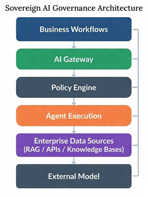

# Sovereign AI Threat Model Framework

[](LICENSE)
[](SECURITY.md)


## What This Repository Provides

This project provides a **threat-driven framework for analyzing security and governance risks in sovereign and agentic AI systems**.

The repository includes:

- AI threat taxonomy for sovereign and agentic AI
- Enterprise AI reference architectures
- Attack trees and threat scenarios
- Sovereign exposure analysis models
- Governance-aligned security control library
- Threat modeling templates for real-world AI deployments

The goal is to help organizations translate **AI governance requirements into concrete security architecture and threat modeling practices.**

---

## Quick Start

If you are new to this repository, start here:

1. **Architecture Overview**  
   Understand the sovereign AI control boundary  
   → `docs/02-reference-architecture.md`

2. **Threat Taxonomy**  
   Review common threats affecting agentic AI systems  
   → `docs/03-threat-taxonomy.md`

3. **Threat Scenarios**  
   Explore realistic attack scenarios  
   → `docs/06-scenarios/`

4. **Security Controls**  
   See mitigation strategies and governance controls  
   → `docs/07-controls/control-library.md`

---

## Related Article

This repository accompanies the article posted on Medium.com:

**"Sovereign AI: Why Agentic Systems Require a New Threat Modeling Perspective"**

:link:(https://rebrand.ly/nhfco3y)

**Threat-driven governance and security architecture framework for sovereign AI and agentic AI systems.**

This repository provides a structured methodology for identifying, modeling, and mitigating security risks in modern AI deployments where **data sovereignty, model governance, and autonomous agent behavior must be tightly controlled**.

The framework focuses on enterprise AI architectures that integrate:

- Agent orchestration systems  
- Retrieval-augmented generation (RAG) pipelines  
- Enterprise data platforms  
- External model providers  
- AI governance and security controls  

It helps organizations translate **AI governance requirements into practical threat models and architectural security controls.**

---

# Why Sovereign AI Security Matters

Modern AI systems are no longer simple inference services. Many enterprise deployments now include **agentic workflows capable of planning actions, invoking tools, and retrieving enterprise data dynamically.**

While these capabilities unlock productivity gains, they also introduce new security and governance risks such as:

- Cross-border data processing and sovereignty violations  
- Prompt injection and instruction manipulation  
- Autonomous agent privilege escalation  
- AI supply chain compromise  
- Loss of governance over model lifecycle and deployment  

Traditional application threat models do not fully capture these risks.

The **Sovereign AI Threat Model Framework** provides a structured way to analyze these threats and translate them into **actionable governance and security controls.**

---

# Reference Architecture

The framework assumes a typical **enterprise AI architecture** composed of several layers.

```text
Users / Business Workflows
↓
AI Application / Copilot Layer
↓
Agent Orchestration Layer
↓
Enterprise Data Sources
(RAG / APIs / Knowledge Bases)
↓
AI Governance Gateway
(Prompt inspection • Policy enforcement • Data controls)
↓
External Model / LLM Provider
↓
Monitoring & Governance Layer
(Audit • risk controls • logging)
```


### Sovereign AI Control Boundary

<p align="center">

</p>

### Governance Architecture

<p align="center">

</p>

These diagrams illustrate the core trust boundaries and control points in sovereign AI deployments.

Threat modeling should focus on the boundaries between:

- agent orchestration systems

- enterprise data environments

- governance control gateways

- external model providers

because those boundaries are where security failures and governance violations most commonly occur.


---

# Framework Components

This repository contains several artifacts that together form a complete threat modeling methodology.

## Threat Taxonomy

A structured classification of risks specific to sovereign and agentic AI systems.

Examples include:

- Sovereign data boundary violations
- Agent autonomy abuse
- Prompt injection attacks
- AI supply chain compromise
- Model lifecycle governance failures

See: [Threat Taxonomy](docs/03-threat-taxonomy.md)


---

## Sovereign Exposure Matrix

A model for assessing whether AI deployments maintain appropriate jurisdictional control over data and inference environments.

This helps identify situations where sovereignty may be compromised.

See: [Sovereign Exposure Matrix](docs/04-sovereign-exposure-matrix.md)


---

## Attack Trees

Attack trees model how adversaries may exploit AI systems.

Example attack paths include:

- Prompt injection leading to data exfiltration
- Agent tool misuse
- Privilege escalation within autonomous workflows
- Model supply chain tampering

See: [Attack Trees](docs/05-attack-trees.md)


---

## Threat Scenarios

Detailed threat scenarios illustrate realistic security failures in AI deployments.

Examples include:

- Cross-border inference leakage
- Agent tool abuse and sensitive data retrieval
- Compromised AI models in the supply chain

See: [Threat Scenarios](docs/06-scenarios/)


---

## Security Control Library

A governance-aligned set of security controls designed to mitigate AI-specific threats.

Controls are grouped into domains including:

- Data sovereignty controls
- Agent governance controls
- Model lifecycle security
- AI supply chain security
- Monitoring and accountability

See: [Control Library](docs/07-controls/control-library.md)


---

## Threat Modeling Templates

Reusable templates allow security teams to apply this framework to their own AI systems.

Templates include:

- Threat model documentation
- Attack path analysis
- Risk scoring
- Governance control mapping

See: [Threat Modeling Templates](docs/08-templates/)


---

# Threat to Control Mapping

This framework connects threats directly to governance controls.

Threat → Attack Path → Control → Governance Framework

Mapping examples include:

- Prompt injection → Prompt filtering controls
- Cross-border inference → Regional inference enforcement
- Agent privilege escalation → Role-based agent permissions

See: [Threat to Control Mapping](docs/10-threat-to-control-mapping.md)


---

# How to Use This Framework

Security architects and governance teams can apply this framework through the following process:

1. Define system boundaries using the reference architecture
2. Classify sovereign data exposure using the exposure matrix
3. Identify threats using the threat taxonomy
4. Model attack paths using attack trees
5. Apply mitigation strategies from the control library
6. Document findings using the threat modeling template

This workflow enables consistent and repeatable AI risk assessments.

---

# Relationship to Existing AI Security Frameworks

This project builds upon existing security and governance frameworks rather than replacing them.

It complements the following established frameworks:

• NIST AI Risk Management Framework (AI RMF)  
• NIST Generative AI Profile (AI 600-1)  
• MITRE ATLAS adversarial machine learning knowledge base  
• OWASP Top 10 for LLM Applications  
While these frameworks describe AI risks and vulnerabilities, this repository focuses specifically on enterprise deployment architectures and sovereign AI control boundaries.


---

# Intended Audience

This framework is designed for:

- Security architects
- AI governance leaders
- Cloud security engineers
- Data protection professionals
- AI platform engineers

It may also be useful for compliance teams and enterprise architects responsible for AI oversight.

---

# Roadmap

Future enhancements may include:

- AI risk scoring engines
- Sovereign policy enforcement tools
- Agentic AI guardrail frameworks
- AI governance dashboards
- Sovereign AI control plane architectures

These projects will build on the concepts introduced in this repository.

---

# Contributing

Contributions are welcome.

If you have ideas for improving the framework, please open an issue or submit a pull request.

See: 

[CONTRIBUTING](CONTRIBUTING.md)


---

# Security

Please review our security policy for guidance on reporting vulnerabilities.

[SECURITY](SECURITY.md)


---

# License

This project is licensed under the MIT License.

See:

[LICENSE](LICENSE.txt)
